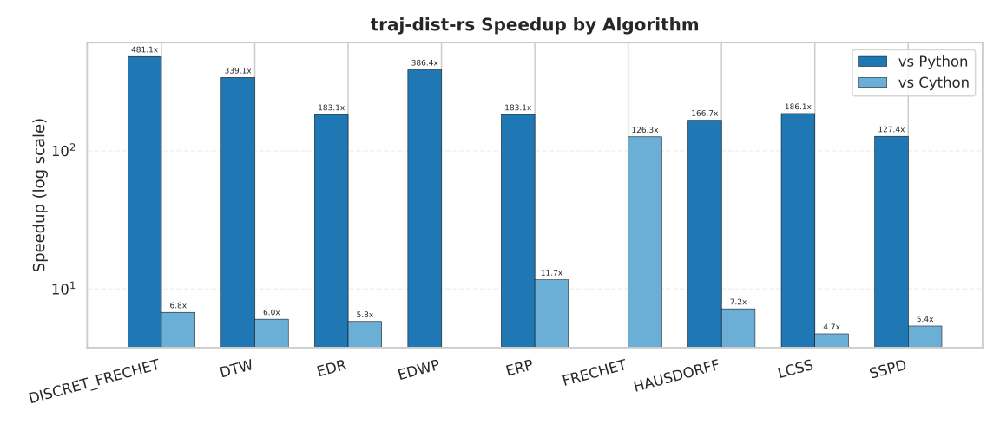
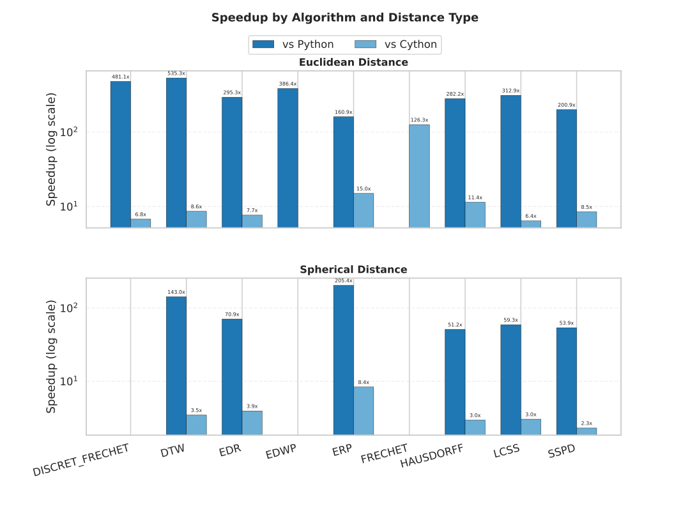
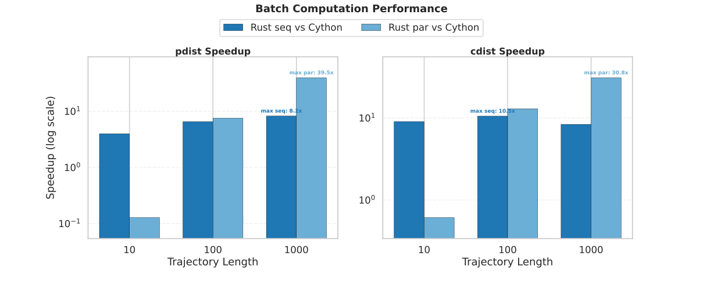

# Performance Benchmark Report

Benchmarks are summarized using the **median runtime**.

## TL;DR

- `traj-dist-rs` is on average **~230x faster** than `traj-dist (Python)`
- `traj-dist-rs` is on average **~6.3x faster** than `traj-dist (Cython)`
- Parallel batch execution reaches up to **~62.3x speedup** over `traj-dist (Cython)` on large inputs

## Benchmark Scope

This report compares `traj-dist-rs`, `traj-dist (Cython)`, and `traj-dist (Python)`.

Algorithms covered:

- DISCRET_FRECHET
- DTW
- EDR
- ERP
- HAUSDORFF
- LCSS
- SSPD

Distance types:

- euclidean
- spherical

All summary values use the **median runtime** across benchmark samples.
Batch benchmarks compare Rust and Cython implementations.

## Figures

## Summary Table

| algorithm       | distance_type   | hyperparam                         | traj-dist-rs   | traj-dist (Cython)   | traj-dist (Python)   | traj-dist-rs vs traj-dist (Cython)   | traj-dist-rs vs traj-dist (Python)   |
|:----------------|:----------------|:-----------------------------------|:---------------|:---------------------|:---------------------|:-------------------------------------|:-------------------------------------|
| DISCRET_FRECHET | euclidean       | eps=None; g=None                   | 0.0009 ms      | 0.0062 ms            | 0.4703 ms            | 6.89x                                | 522.56x                              |
| DTW             | euclidean       | eps=None; g=None                   | 0.0008 ms      | 0.0070 ms            | 0.4521 ms            | 8.75x                                | 565.12x                              |
| DTW             | spherical       | eps=None; g=None                   | 0.0026 ms      | 0.0094 ms            | 0.3807 ms            | 3.62x                                | 146.40x                              |
| EDR             | euclidean       | eps=0.01; g=None                   | 0.0010 ms      | 0.0064 ms            | 0.3089 ms            | 6.40x                                | 308.90x                              |
| EDR             | spherical       | eps=0.01; g=None                   | 0.0030 ms      | 0.0091 ms            | 0.2117 ms            | 3.03x                                | 70.55x                               |
| ERP             | euclidean       | eps=None; g=[-122.41443, 37.77646] | 0.0016 ms      | 0.0197 ms            | 0.2717 ms            | 12.31x                               | 169.81x                              |
| ERP             | spherical       | eps=None; g=[-122.41443, 37.77646] | 0.0042 ms      | 0.0265 ms            | 0.8237 ms            | 6.31x                                | 196.11x                              |
| HAUSDORFF       | euclidean       | eps=None; g=None                   | 0.0014 ms      | 0.0166 ms            | 0.4231 ms            | 11.86x                               | 302.21x                              |
| HAUSDORFF       | spherical       | eps=None; g=None                   | 0.0249 ms      | 0.0727 ms            | 1.3400 ms            | 2.92x                                | 53.82x                               |
| LCSS            | euclidean       | eps=0.01; g=None                   | 0.0009 ms      | 0.0058 ms            | 0.2982 ms            | 6.44x                                | 331.33x                              |
| LCSS            | spherical       | eps=0.01; g=None                   | 0.0028 ms      | 0.0083 ms            | 0.1700 ms            | 2.96x                                | 60.71x                               |
| SSPD            | euclidean       | eps=None; g=None                   | 0.0020 ms      | 0.0165 ms            | 0.4206 ms            | 8.25x                                | 210.30x                              |
| SSPD            | spherical       | eps=None; g=None                   | 0.0326 ms      | 0.0712 ms            | 1.8739 ms            | 2.18x                                | 57.48x                               |

## Key Findings

- Against `traj-dist (Cython)`, the largest single-case speedup is **12.31x** on **ERP (euclidean)**.
- Against `traj-dist (Python)`, the largest single-case speedup is **565.12x** on **DTW (euclidean)**.
- On **euclidean** benchmarks, `traj-dist-rs` is on average **8.70x** faster than `traj-dist (Cython)` and **344.32x** faster than `traj-dist (Python)`.
- On **spherical** benchmarks, `traj-dist-rs` is on average **3.50x** faster than `traj-dist (Cython)` and **97.51x** faster than `traj-dist (Python)`.
- In batch mode, parallel Rust reaches up to **62.32x** speedup on `pdist` and **51.53x** on `cdist`.

## Batch Computation

### Configuration

- **Algorithm**: dtw
- **Number of trajectories**: 5 (fixed)
- **pdist computation**: 10 distances
- **Trajectory lengths tested**: 10, 100, 1000
- **Distance types**: euclidean, spherical

### Results

| Function   | Distance Type   |   Traj Length |   Distances | traj-dist (Cython) (ms)   | traj-dist-rs Seq (ms)   | traj-dist-rs Par (ms)   | Speedup (Seq)   | Speedup (Par)   |
|:-----------|:----------------|--------------:|------------:|:--------------------------|:------------------------|:------------------------|:----------------|:----------------|
| cdist      | euclidean       |            10 |          25 | 0.2315 ms                 | 0.0152 ms               | 0.4327 ms               | 15.23x          | 0.54x           |
| cdist      | euclidean       |           100 |          25 | 16.5879 ms                | 0.9157 ms               | 0.8914 ms               | 18.11x          | 18.61x          |
| cdist      | euclidean       |          1000 |          25 | 1348.2364 ms              | 98.2446 ms              | 26.1649 ms              | 13.72x          | 51.53x          |
| cdist      | spherical       |            10 |          25 | 0.3073 ms                 | 0.1091 ms               | 0.4480 ms               | 2.82x           | 0.69x           |
| cdist      | spherical       |           100 |          25 | 25.0034 ms                | 8.5706 ms               | 3.4372 ms               | 2.92x           | 7.27x           |
| cdist      | spherical       |          1000 |          25 | 2492.1669 ms              | 835.7577 ms             | 245.3529 ms             | 2.98x           | 10.16x          |
| pdist      | euclidean       |            10 |          10 | 0.0828 ms                 | 0.0169 ms               | 0.5908 ms               | 4.90x           | 0.14x           |
| pdist      | euclidean       |           100 |          10 | 5.1769 ms                 | 0.5084 ms               | 0.6494 ms               | 10.18x          | 7.97x           |
| pdist      | euclidean       |          1000 |          10 | 537.6616 ms               | 40.2273 ms              | 8.6270 ms               | 13.37x          | 62.32x          |
| pdist      | spherical       |            10 |          10 | 0.1215 ms                 | 0.0397 ms               | 1.0569 ms               | 3.06x           | 0.11x           |
| pdist      | spherical       |           100 |          10 | 9.9536 ms                 | 3.4735 ms               | 1.3983 ms               | 2.87x           | 7.12x           |
| pdist      | spherical       |          1000 |          10 | 999.8620 ms               | 322.2799 ms             | 60.0632 ms              | 3.10x           | 16.65x          |

### Notes

- `traj-dist-rs` sequential already outperforms `traj-dist (Cython)` across the tested batch cases.
- Parallel Rust provides the largest gains on longer trajectories.
- For small inputs, parallel overhead can outweigh the benefits of parallel execution.
